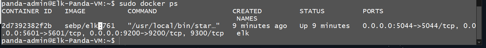

## Automated ELK Stack Deployment

The files in this repository were used to configure the network depicted below.

.png)

These files have been tested and used to generate a live ELK deployment on Azure. They can be used to either recreate the entire deployment pictured above. Alternatively, select portions of the install_elk.yml file may be used to install only certain pieces of it, such as Filebeat.

  - [ELK Yaml Playbook](https://github.com/TeaLeafMedia/TeaLeaf_CyberSec/blob/main/Ansible/install-elk.yml)

This document contains the following details:
- Description of the Topology
- Access Policies
- ELK Configuration
  - Beats in Use
  - Machines Being Monitored
- How to Use the Ansible Build

### Description of the Topology

The main purpose of this network is to expose a load-balanced and monitored instance of DVWA, the D*mn Vulnerable Web Application.

Load balancing ensures that the application will be highly stable, in addition to restricting access to the network.
- Load balancers focus mainly on the Availability portion of the CIA triad, being able to divert traffic if loads are too high or if one maching goes down. Also, using a jumpbox to access the containers adds a layer of security because rules are setup to only allow the private IP of the jumpbox to make changes to the other Web VMs. 

Integrating an ELK server allows users to easily monitor the vulnerable VMs for changes to the metrics and system logs.
- Filebeat gathers information on system logs.
- Metricbeat collects data on system metrics like CPU usage or RAM.

The configuration details of each machine may be found below.
_Note: Use the [Markdown Table Generator](http://www.tablesgenerator.com/markdown_tables) to add/remove values from the table_.

| Name     | Function | IP Address | Operating System |
|----------|----------|------------|------------------|
| Jump Box | Gateway  | 10.1.0.4   | Linux            |
| Elk VM   | Kibana   | 10.2.0.4   | Linux            |
| PandaVM1 | Elk Host | 10.1.0.5   | Linux            |
| PandaVM2 | Elk Host | 10.1.0.6   | Linux            |

### Access Policies

The machines on the internal network are not exposed to the public Internet. 

Only the Jump-Box-Provisioner machine can accept connections from the Internet. Access to this machine is only allowed from the following IP addresses:
- 71.203.227.158 (This may have to be updated occasionally due to VPN)

Machines within the network can only be accessed by the jumpbox once the Ansible container is attached to.
- The jumpbox is able to ssh into the Elk VM once it has connected to the zen_dewdney container. It's IP is 10.1.0.4.

A summary of the access policies in place can be found in the table below.

| Name     | Publicly Accessible | Allowed IP Addresses |
|----------|---------------------|----------------------|
| Jump Box | Yes                 | 71.203.227.158       |
| Elk VM   | No (Jumbox access)  | 10.1.0.4             |
| Web VMs  | No (jumbox access)  | 10.1.0.4             |

### Elk Configuration

Ansible was used to automate configuration of the ELK machine. No configuration was performed manually, which is advantageous because...
- Creating a playbook allows you to run a set of specified tasks and do it on multiple containers at once, saving time, and being able to do this quickly on multiple machines. 

The playbook implements the following tasks:
- _TODO: In 3-5 bullets, explain the steps of the ELK installation play. E.g., install Docker; download image; etc._
- ...
- ...

The following screenshot displays the result of running `docker ps` after successfully configuring the ELK instance.

### Target Machines & Beats
This ELK server is configured to monitor the following machines:
- _TODO: List the IP addresses of the machines you are monitoring_

We have installed the following Beats on these machines:
- _TODO: Specify which Beats you successfully installed_

These Beats allow us to collect the following information from each machine:
- _TODO: In 1-2 sentences, explain what kind of data each beat collects, and provide 1 example of what you expect to see. E.g., `Winlogbeat` collects Windows logs, which we use to track user logon events, etc._

### Using the Playbook
In order to use the playbook, you will need to have an Ansible control node already configured. Assuming you have such a control node provisioned: 

SSH into the control node and follow the steps below:
- Copy the _____ file to _____.
- Update the _____ file to include...
- Run the playbook, and navigate to ____ to check that the installation worked as expected.

_TODO: Answer the following questions to fill in the blanks:_
- _Which file is the playbook? Where do you copy it?_
- _Which file do you update to make Ansible run the playbook on a specific machine? How do I specify which machine to install the ELK server on versus which to install Filebeat on?_
- _Which URL do you navigate to in order to check that the ELK server is running?

_As a **Bonus**, provide the specific commands the user will need to run to download the playbook, update the files, etc._
